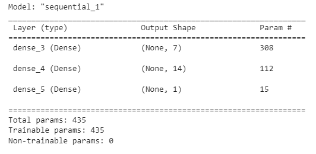
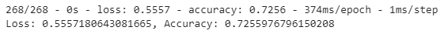
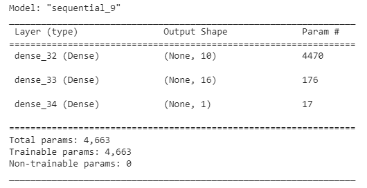
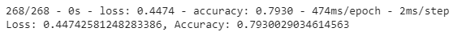

# deep-learning-challenge
## Module 21 Challenge
For this challenge I received a CSV containing more than 34,000 organizations that have received funding from Alphabet Soup over the years. I was tasked with building a tool that can help it select the applicants for funding with the best chance of success in their ventures. With my knowledge of machine learning and neural networks, I used the features in the provided dataset to create a binary classifier that can predict whether applicants will be successful if funded by Alphabet Soup.

## Preprocessing the Data
First I read the charity_data.csv to a Pandas DataFrame, and identified what variable is the target for the model and what variables are the features for the model. I dropped the EIN and NAME columns, determine the number of unique values for each column, used the number of data points for each unique value to pick a cutoff point to bin "rare" categorical variables together in a new value, Other, and then check if the binning was successful. Using pd.get_dummies() I encoded categorical variables, then split the preprocessed data into a features array, X, and a target array, y. Using these arrays and the train_test_split function I split the data into training and testing datasets.

## Compile, Train, and Evaluate the Model
I used my knowledge of TensorFlow and designed a neural network to create a binary classification model that can predict if an Alphabet Soup-funded organization will be successful based on the features in the dataset.

Here is my first attempt:

## Optimize the Model
Using much of the same steps as the process before, I used my knowledge of TensorFlow to optimize the model to achieve a target predictive accuracy higher than 75%.

I was tasked to use any or all of the following methods to optimize the model:

* Adjust the input data to ensure that no variables or outliers are causing confusion in the model, such as:
    * Dropping more or fewer columns.
    * Creating more bins for rare occurrences in columns.
    * Increasing or decreasing the number of values for each bin.
    * Add more neurons to a hidden layer.
    * Add more hidden layers.
    * Use different activation functions for the hidden layers.
    * Add or reduce the number of epochs to the training regimen.

Below is my second attempt:

## Write a Report on the Neural Network Model
For this part of the assignment, I was tasked to write a report on the performance of the deep learning model I created for Alphabet Soup. The report can be viewed [here](Neural_Network_Model_Report.pdf).

The report should contain the following:

1. Overview of the analysis: Explain the purpose of this analysis.

2. Results: Using bulleted lists and images to support your answers, address the following questions:

* Data Preprocessing

    * What variable(s) are the target(s) for your model?
    * What variable(s) are the features for your model?
    * What variable(s) should be removed from the input data because they are neither targets nor features?

* Compiling, Training, and Evaluating the Model

    * How many neurons, layers, and activation functions did you select for your neural network model, and why?
    * Were you able to achieve the target model performance?
    * What steps did you take in your attempts to increase model performance?

3. Summary: Summarize the overall results of the deep learning model. Include a recommendation for how a different model could solve this classification problem, and then explain your recommendation.